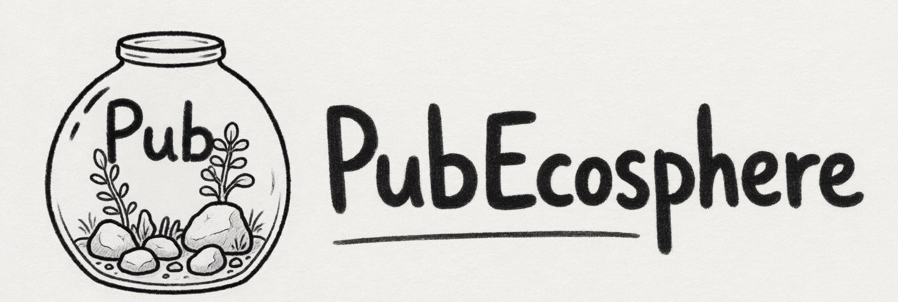

<p align="center">
  
  <br>
  <h1>PubEcosphere</h1>
  PubPeer 学术诚信周报生成管线：抓取 → 两阶段打分 → LLM 周报<br><br>
  <a href="https://piwir.github.io/PubEcosphere/"><b>官网</b></a>
  &nbsp;·&nbsp;
  <a href="images/QR.png"><b>微信公众号</b></a>
</p>

基于 PubPeer（pubpeer.com）公开评论，抓取存在**作者与打假人激烈交锋**的论文，多维度打分排序，由大模型生成周报；整条流水线封装成 **MCP server**，可挂载到**个人 agent** 作为组件使用。

## 项目简介

学术打假是维护科研诚信的重要防线。PubPeer 是全球最大的学术评论平台之一，评论区常上演作者申辩与质疑者对线的交锋。本系统：

- **自动监控** PubPeer 高关注论文的评论动态
- **智能打分** 筛选值得报道的「激烈交锋」案例
- **周报化** 由大模型生成 HelloGitHub 式周报
- **MCP 组件化** 流水线封装成 MCP server，可挂载到个人 agent 部署使用

## 核心工作流

```text
capture（每日捕获 feed）→ revisit（≥7 天后回访评论线程）→ rank（两阶段打分选优）
→ pick（每类选篇打包）→ material（图材合并）→ LLM 生成周报
→ 手动粘贴发布公众号 → 更新 site.json（官网）
```

## 快速开始

前置：Python 3 环境（`conda activate pubecosphere`）；安装项目依赖（`pip install -r requirements.txt`）；配置 API 密钥（见「LLM 配置」）。

```bash
# 爬虫
python -m crawler.crawl --db data/pubpeer.db capture            # 每日捕获 feed
python -m crawler.crawl --db data/pubpeer.db revisit --limit 50  # 回访

# 生成
ISSUE=n ./run_issue.sh                    # 一键跑一期全流程
```

脚本流程（**数据由 cron 爬虫供给，脚本默认不跑爬虫**）：`capture/revisit(可选) → rank → pick → material → generate/assemble → md2html → polish_html → inline_images(base64)`。

常用环境变量（完整见 [run_issue.sh](run_issue.sh) 头部注释）：

| 变量 | 默认 | 说明 |
| --- | --- | --- |
| `ISSUE` | `1` | 期号 |
| `WINDOW` | `"10 3"` | 回访/打分相对窗口（天） |
| `WINDOW_FIELD` | `captured_at` | 打分日期基准字段 |
| `MIN_SCORE` | `0.50` | pick 选稿门槛 |
| `RUN_CAPTURE` | `0` | `1` = 先跑每日 capture（默认 0：capture 是每日 cron 操作） |
| `RUN_REVISIT` | `0` | `1` = 先跑回访 revisit（默认 0：数据由长期 cron 爬虫供给，脚本只管生成） |
| `DRY_RUN` | `0` | `1` = 只预览 pick |

每期产物在 `output/issue/<期号>/`：`score/`（打分报告）、`pub/` + `manifest.*`（素材与清单；图材合并图与结构化素材 md 写回 `pub/<pid>_files/`）、`weekly/`（周报成品 + `*-base64.html` 微信粘贴用）。不用脚本时各步骤的单条命令见 `run_issue.sh` 头注释与 [agent/README.md](agent/README.md)。

## LLM 周报生成

- `python -m llm generate` 用**同一个模型**完成提取 + 写稿（纯文本，图片描述来自评论者配图时的原话）。

提示词见 `docs/prompts/`。

### LLM 配置

密钥只走环境变量 / 仓库根 `.env`：

```bash
cp .env.example .env        # 填入 PUBECOSPHERE_LLM_API_KEY=sk-…
```

单模型路径变量：`PUBECOSPHERE_LLM_MODEL`（默认 deepseek-v4-flash）、`PUBECOSPHERE_LLM_MAX_TOKENS`（默认顶满模型上限）。

## MCP 集成（agent 组件）

流水线封装成 **MCP server**，可挂载到任何 MCP 客户端当作一个组件使用。Server 是无状态薄层：智能在确定性 CLI + 机器可读状态（`status`）+ 明确退出码里，工具只做转发。

**前提**：`pip install -r requirements.txt`；`cd vendor/md2html-cli && npx -y bun install`（首次联网拉传递依赖一次）；`.env` 配 `PUBECOSPHERE_LLM_API_KEY`（仅 `generate` 需要）。

**挂载**（任何 MCP 客户端的 MCP 配置里添加，必须**绝对路径**启动脚本）：

```json
{
  "mcpServers": {
    "pubecosphere": {
      "command": "bash",
      "args": ["/abs/path/to/PubEcosphere/agent/mcp.sh"]
    }
  }
}
```

> 客户端健康检查时 cwd=`/`、PATH 无 conda，`agent/mcp.sh` 负责自切仓库根 + 解析 python；找不到 python 时加 `"env": {"PYTHON": "/path/to/python"}`。

**其他 MCP 客户端**：在 MCP 配置里添加同样命令（server 自推导仓库根，无需指定 cwd）。

**使用建议**：agent 起步先 `status` 自查，`pick` 先 `dry_run=true` 给人工批准，`generate` 后人工审草稿。13 个工具详见 [agent/README.md](agent/README.md)。

## 网站

https://piwir.github.io/PubEcosphere/ （Vue 3 + Vite，GitHub Actions 自动部署）：展示**当前期号**与公众号入口，另有往期归档与项目介绍。

站点数据由单文件 `site/src/data/site.json` 手动维护。**每期发布后**编辑该文件并 push，Actions 自动重新部署：

1. `currentIssue` / `issueDate` / `window` → 新一期；
2. `wechat.url` / `wechat.label` → 新一期公众号文章链接；
3. `issues` 数组头部加一条 `{ "issue": N, "date": "YYYY-MM-DD", "wechatUrl": "…", "summary": "一句话摘要" }`。

本地开发与换图说明见 [site/README.md](site/README.md)。

## 数据来源

- **中科院分区表 2025（大类/小类/分区/Top）**：`data/cas2025.csv`，源自 [hitfyd/ShowJCR](https://github.com/hitfyd/ShowJCR) 整理的中科院文献情报中心分区表。
- **JCR 影响因子 2025**：`data/jcr2025.csv`，同源仓库（`JCR2025-UTF8.csv`）。
- **CCF 推荐目录 2026 / 计算领域高质量期刊 T 分级**：`data/ccf2026.csv` / `data/ccft2025.csv`，同源仓库。
- **国际期刊预警名单 2025**：`data/journal_alert.csv`，同源仓库（`GJQKYJMD2025.csv`）。
- **PubPeer 数据**：官方 `/api/recent` feed + 文章页 + `/v3/publications`（DOI 反馈摘要）。
- **DOI 解析**：CrossRef API（`api.crossref.org`，按 ISSN 过滤 + 容器期刊名校验）。
- 以上数据文件均在 `data/`。
- `data/*.csv`（分区表/JCR/CCF/预警）随仓库提交，派生自 [hitfyd/ShowJCR](https://github.com/hitfyd/ShowJCR)（**GPLv3**）；原数据版权归中科院文献情报中心 / Clarivate / CCF 等来源方，**不属本项目 MIT 代码**。自行下载使用需遵循 ShowJCR 及原始数据条款。

## md→html 转换器

周报 md 转微信兼容 HTML 使用仓库内 **vendored 转换器**（`vendor/md2html/` 包 + `vendor/md2html-cli/` 薄 CLI，经裁剪：去掉 mermaid，bun 默认经 `npx -y bun` 启动），不依赖任何外部 skill。该转换器派生自 [JimLiu/baoyu-skills](https://github.com/JimLiu/baoyu-skills)（baoyu-md，MIT License），License 保留于 `vendor/md2html/src/LICENSE`。

## 项目结构

```
PubEcosphere/
├── crawler/            # 爬虫模块
├── scoring/            # 打分系统
├── llm/                # LLM 周报生成
├── agent/              # MCP server
├── vendor/md2html/     # md→html 
├── vendor/md2html-cli/ # 转换器薄 CLI
├── run_issue.sh        # 一键流水线脚本
├── requirements.txt    # Python 运行时依赖
├── site/               # 网站
├── images/             # 项目素材
├── data/               # 运行数据
├── output/             # 输出周报
├── docs/               # 文档
└── .gitignore
```

## 详细文档

| 文档 | 内容 |
| --- | --- |
| `docs/prompts/` | 文本提取 / 写稿 两套提示词 |
| `agent/README.md` | MCP 工具详细文档 |
| `site/README.md` | 网站说明 |

## 免责声明

1. 本项目仅供学术诚信研究与交流使用，所有数据来源于 PubPeer 公开评论。
2. 本项目不对因使用本系统造成的任何后果负责。

## License

本仓库代码以 **MIT License** 开源（见 [LICENSE](LICENSE)）。vendored 转换器 `vendor/md2html/` 派生自 [JimLiu/baoyu-skills](https://github.com/JimLiu/baoyu-skills)（baoyu-md，MIT），其 License 保留于 `vendor/md2html/src/LICENSE`。外部数据版权归各自来源方：`data/*.csv` 派生自 [hitfyd/ShowJCR](https://github.com/hitfyd/ShowJCR)（GPLv3，原数据归中科院文献情报中心 / Clarivate / CCF 等），**数据文件不属本项目 MIT 代码**；PubPeer / CrossRef 数据归对应平台。
